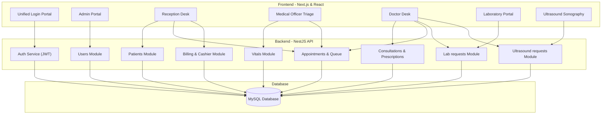
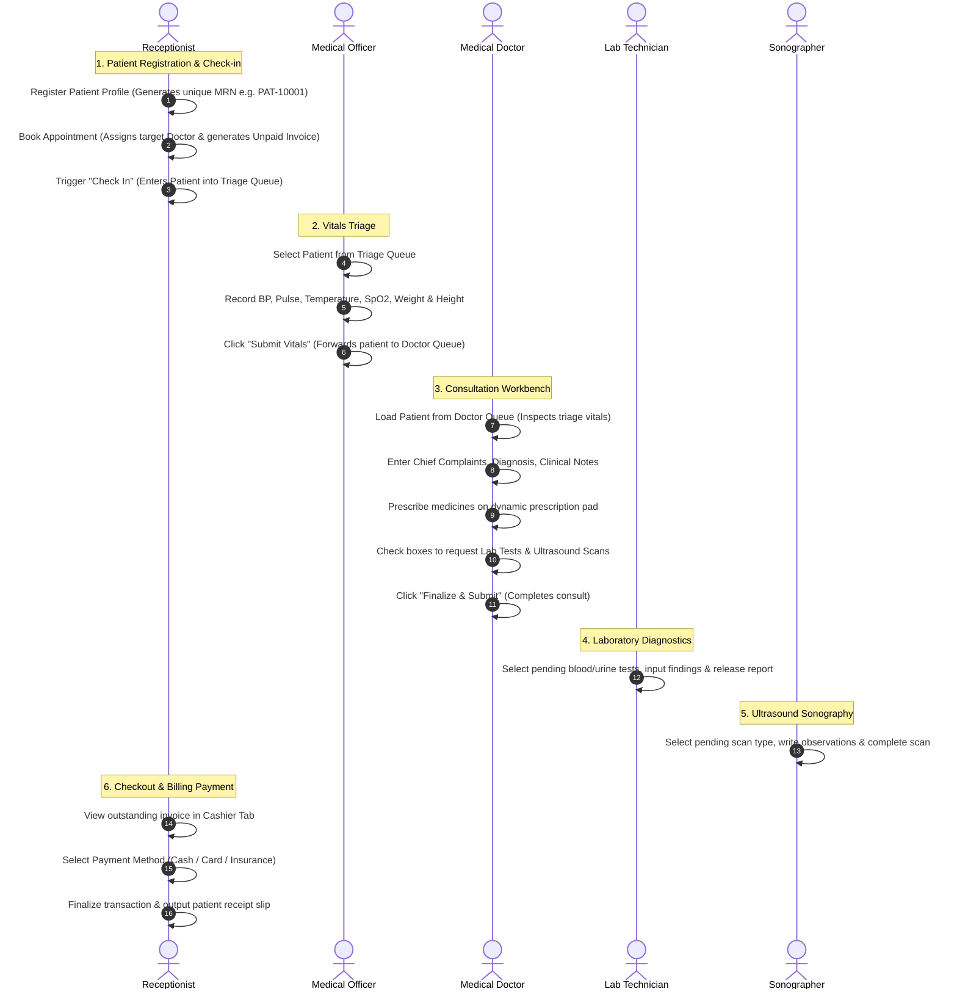

# Medicflow - Hospital Management System (HMS)

Medicflow is a premium, portfolio-grade **Hospital Management System (HMS)** built with a modern decoupled stack: a high-performance **NestJS backend** powered by **Sequelize ORM** and **MySQL**, and a sleek **Next.js frontend** utilising **React** and **Tailwind CSS**. 

The system implements Role-Based Access Control (RBAC) across six dedicated portals, syncing clinical departments in real-time.

---

## 🏛️ System Architecture



---

## 🏥 Clinical Patient Lifecycle Flowchart

The system models the patient journey from check-in to payment settlement with clear separation of duties:



---

## 🔑 Seed User Logins

The backend automatically seeds a default user for each hospital role on its first boot. You can use the **Quick Test Access** clickable grid on the login screen to fill in these credentials instantly:

| Role Portal | Username | Password | Dashboard URL | Main Capabilities |
| :--- | :--- | :--- | :--- | :--- |
| **Admin** | `admin` | `admin123` | `/admin` | Manage user profiles (CRUD), toggle accounts, system metrics |
| **Receptionist** | `reception` | `reception123` | `/reception` | Register patients, schedule appointments, cashier checkout |
| **Medical Officer** | `mo` | `mo123` | `/mo` | Take triage vitals, forward patients to doctors |
| **Doctor** | `doctor` | `doctor123` | `/doctor` | Write clinical diagnostics notes, prescriptions, request scans |
| **Lab Technician** | `lab` | `lab123` | `/laboratory` | Review lab orders, submit blood/pathology results |
| **Sonographer** | `ultrasound` | `ultrasound123` | `/ultrasound` | Log ultrasound findings, attach sonogram images |

---

## 🚀 Setting Up the Application

### Prerequisites
1. Install **Node.js** (v18+ recommended) and **npm**.
2. Run a local **MySQL** server instance on port `3306`.
3. Create an empty database in MySQL:
   ```sql
   CREATE DATABASE hospital_management_system;
   ```

### 1. Backend Setup (NestJS)
1. Go into the backend directory:
   ```bash
   cd backend
   ```
2. Configure credentials in [backend/.env](file:///d:/Projects/NodeJS/Hospital_Management_System/backend/.env) if your local MySQL settings differ:
   ```env
   DB_HOST=127.0.0.1
   DB_PORT=3306
   DB_USER=root
   DB_PASSWORD=
   DB_NAME=hospital_management_system
   JWT_SECRET=hms_super_secret_jwt_key_2026_antigravity
   PORT=3001
   ```
3. Run the development server:
   ```bash
   npm run start:dev
   ```
   *The database schema tables will automatically migrate and populate user seeds.*

### 2. Frontend Setup (Next.js)
1. Go into the frontend directory:
   ```bash
   cd frontend
   ```
2. Run the development server:
   ```bash
   npm run dev
   ```
3. Open [http://localhost:3000](http://localhost:3000) in your browser to start testing.
