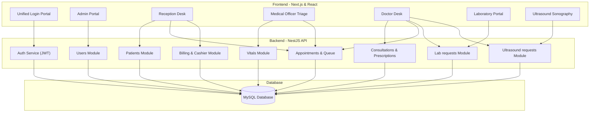
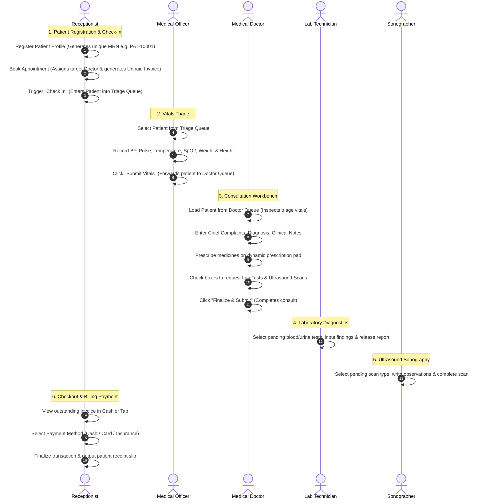
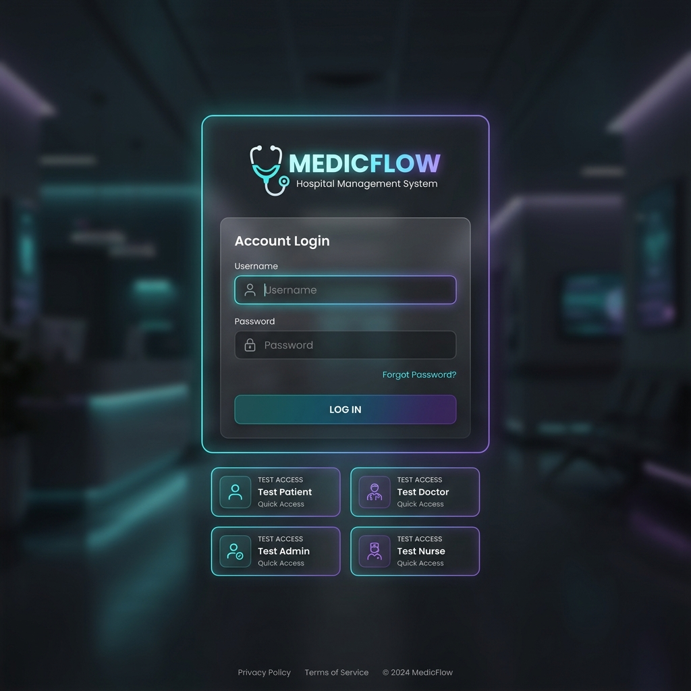
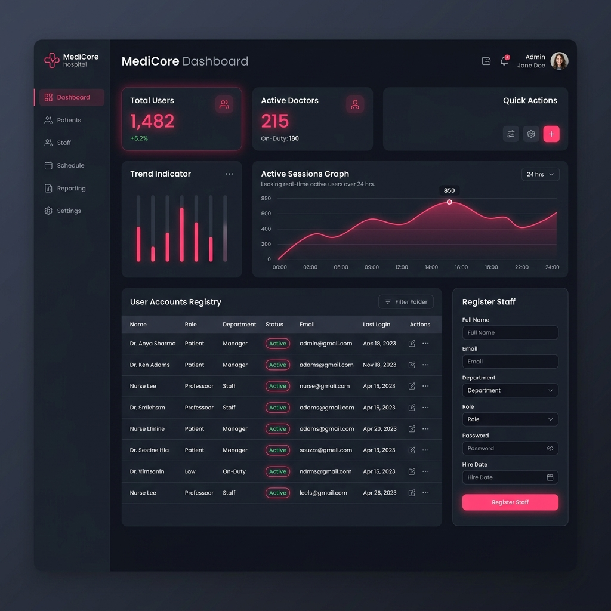
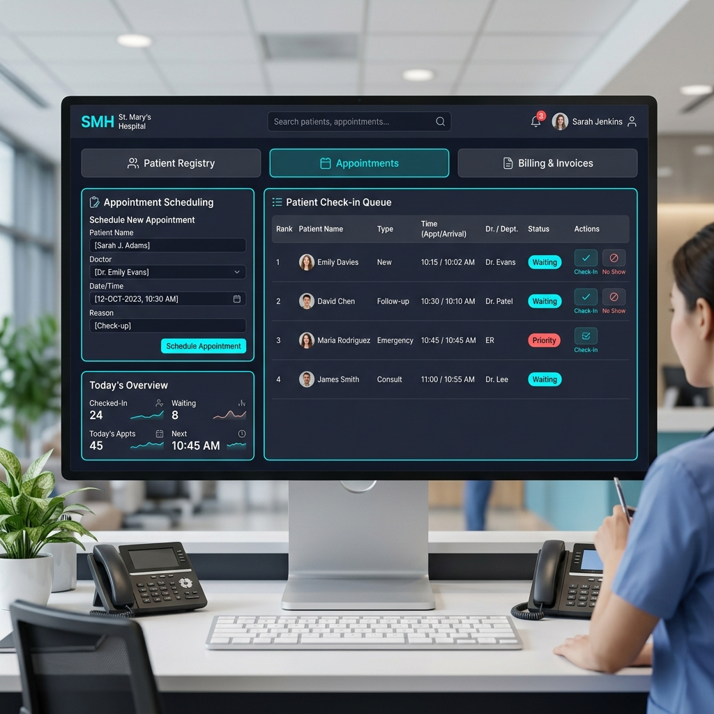
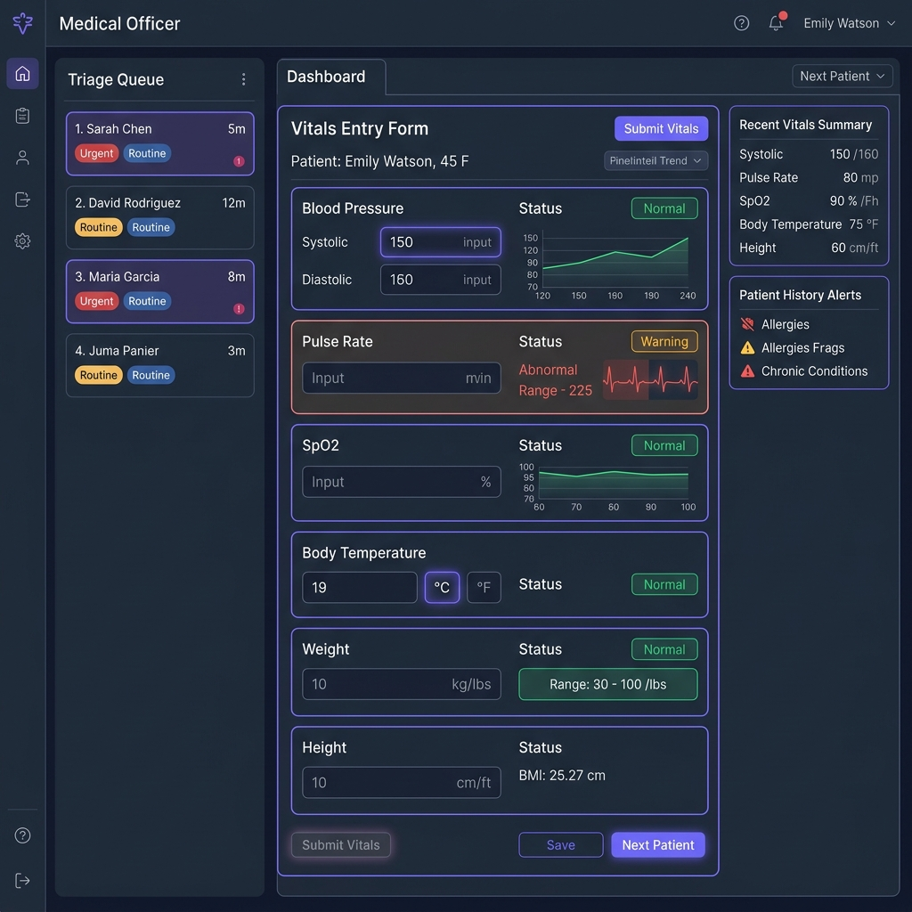
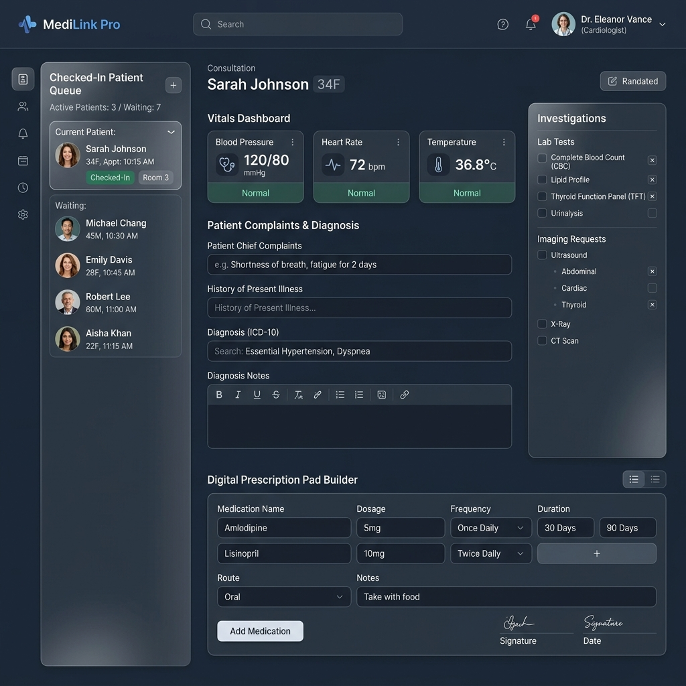
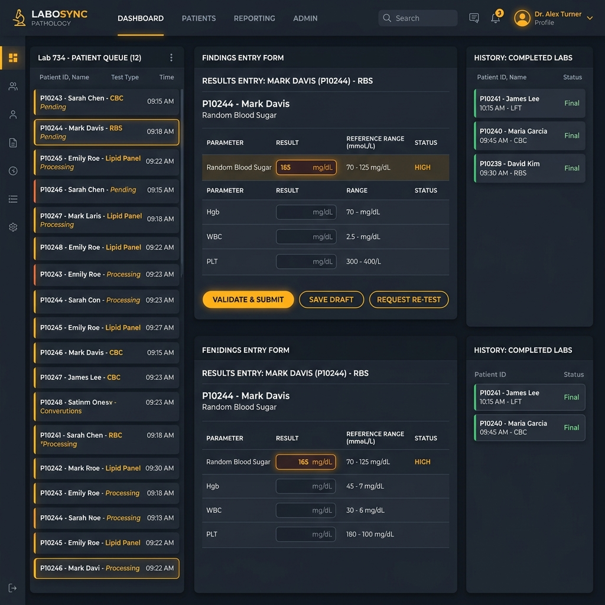
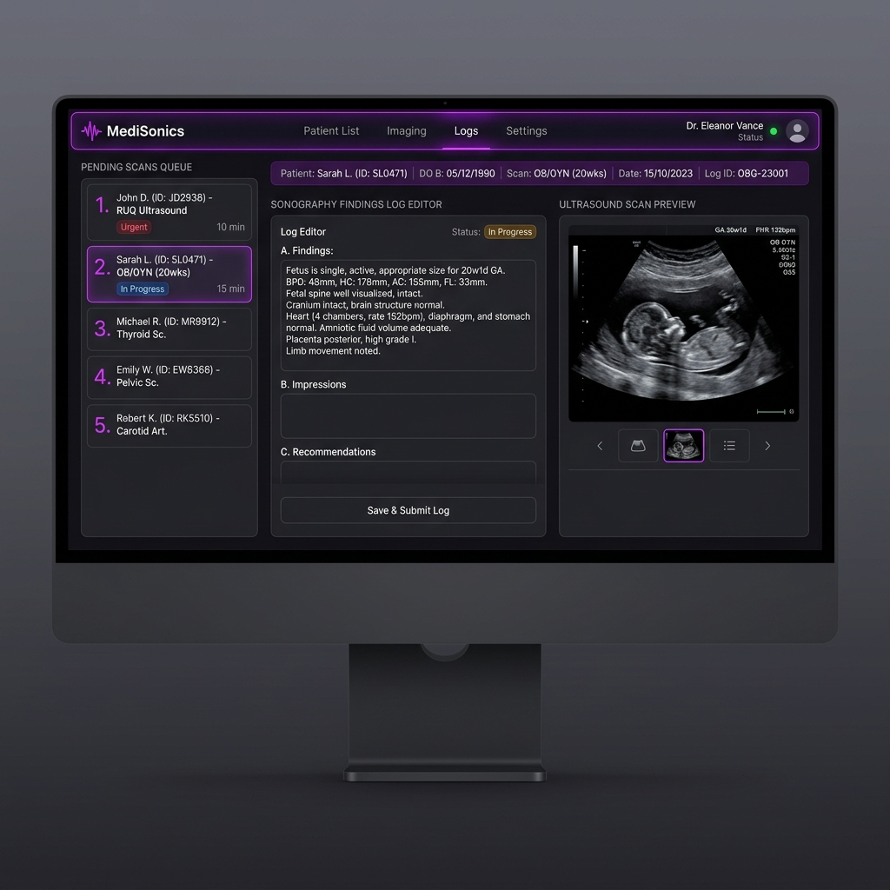

# Medicflow - Hospital Management System (HMS)

Medicflow is a premium, portfolio-grade **Hospital Management System (HMS)** built with a modern decoupled stack: a high-performance **NestJS backend** powered by **Sequelize ORM** and **MySQL**, and a sleek **Next.js frontend** utilising **React** and **Tailwind CSS**.

The system implements Role-Based Access Control (RBAC) across six dedicated portals, syncing clinical departments in real-time.

---

## 🏛️ System Architecture



---

## 🏥 Clinical Patient Lifecycle Flowchart

The system models the patient journey from check-in to payment settlement with clear separation of duties:



---

## 💻 Portal Section Details & UI Layouts

### 1. Unified Secure Login Portal (`/login`)

The gateway features a centralized, glassmorphic login panel. The user inputs their credentials, and the system decodes the JWT payload to direct them automatically to their respective role. To facilitate rapid validation and testing, an interactive **Quick Test Access** selector is embedded, allowing users to pre-fill credentials in one click.



---

### 2. Hospital Administration Panel (`/admin`)

- **User Management**: Admins have total CRUD access to register staff accounts, change roles (Admin, Receptionist, MO, Doctor, Lab Tech, Sonographer), and activate/deactivate accounts.
- **System Metrics**: Visual widgets displaying total staff, active doctors, and active sessions.



---

### 3. Hospital Reception Workspace (`/reception`)

This module handles patient onboarding, scheduler planning, queue triage, and cashier invoice settlements:

- **Patient Registry Tab**: Captures name, gender, contact details, date of birth (calculates age), and assigns an automatic sequential MRN.
- **Appointments & Check-in Tab**: Assigns patients to doctors and checks them in. Checked-in patients are automatically routed to the Medical Officer's triage queue.
- **Billing & Cashier Tab**: Tracks active consultation invoices, processes cash/card payments, and launches a printable receipt modal upon checkout.



---

### 4. Medical Officer Triage Desk (`/mo`)

This portal allows Medical Officers (MOs) to manage patient check-in queues:

- **Triage Queue**: Displays a list of checked-in patients waiting for vital logging.
- **Metrics Log**: Forms to enter blood pressure (systolic/diastolic), pulse rate, body temperature, respiratory rate, SpO2, height, and weight.
- **Triage Forward**: Click to submit metrics, which automatically transitions the patient status to `IN_PROGRESS` and routes them to the assigned doctor.



---

### 5. Doctor Consultation Desk (`/doctor`)

The medical consultant's clinical desk connects history, vitals, checkup notes, prescriptions, and diagnostic orders:

- **Triage Vitals Preview**: Inspects vital metrics logged by the MO.
- **Consultation Records**: Fields to input chief complaints, clinical exam notes, and diagnosis.
- **Prescription Pad Builder**: An interactive builder to add medications, dosages, timings, durations, and instructions dynamically.
- **Diagnostics Order**: Order lab tests and ultrasound scans. Completed tests are displayed dynamically.
- **Clinical History**: Toggle tab showing chronological previous consultation records and prescriptions for the selected patient.



---

### 6. Pathology Laboratory Portal (`/laboratory`)

- **Pending Queue**: Displays test requests ordered by doctors (e.g. CBC, RBS).
- **Findings Editor**: Lab technicians enter pathology reports and release completed test results back to the doctor.



---

### 7. Ultrasound Sonography Portal (`/ultrasound`)

- **Ultrasound Scan Console**: View requested scans (e.g. Abdomen Scan, Pelvic US).
- **Sonography Editor**: Enter observations, impressions, and select simulated diagnostic scan images to attach to the report.



---

## 🚀 Setting Up the Application

### Prerequisites

1. Install **Node.js** (v18+) and **npm**.
2. Run a local **MySQL** server instance on port `3306`.
3. Create an empty database in MySQL:
   ```sql
   CREATE DATABASE hospital_management_system;
   ```

### 1. Backend Setup (NestJS)

1. Go into the backend directory:
   ```bash
   cd backend
   ```
2. Configure credentials in [backend/.env](file:///d:/Projects/NodeJS/Hospital_Management_System/backend/.env) if your local MySQL settings differ:
   ```env
   DB_HOST=127.0.0.1
   DB_PORT=3306
   DB_USER=root
   DB_PASSWORD=
   DB_NAME=hospital_management_system
   JWT_SECRET=hms_super_secret_jwt_key_2026_antigravity
   PORT=3001
   ```
3. Run the development server:
   ```bash
   npm run start:dev
   ```
   _The database schema tables will automatically migrate and populate user seeds._

### 2. Frontend Setup (Next.js)

1. Go into the frontend directory:
   ```bash
   cd frontend
   ```
2. Run the development server:
   ```bash
   npm run dev
   ```
3. Open [http://localhost:3000](http://localhost:3000) in your browser to start testing.
